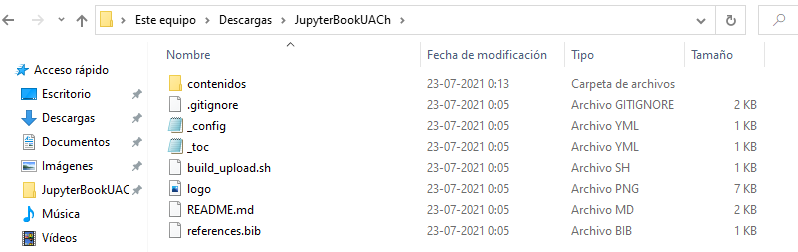

# Archivos importantes de la plantilla

La carpeta de la plantilla debería tener contenidos similares a los que se muestran en la siguiente imágen



A continuación revisaremos los más importantes para customizar el aspecto del libro

## `_toc.yml`

El archivo `_toc.yml` es archivo [YAML](https://en.wikipedia.org/wiki/YAML) que se puede abrir y modificar con un editor de texto plano como Block de notas (Windows), gedit (Ubuntu) o similares

Se debería ver similar al siguiente ejemplo

```yml
format: jb-book
root: README
parts:
  - caption: Instalación y uso de jupyter book
    numbered: true
    chapters:
    - file: contenidos/unidad1/clase1
    - file: contenidos/unidad1/clase2
  - caption: Escribiendo los contenidos del libro
    numbered: true
    chapters:
    - file: contenidos/unidad2/clase3
```

Este archivo es la tabla de contenidos que le da la estructura al libro. Existen varias formas de estructurar el libro como se explica [aquí](https://jupyterbook.org/customize/toc.html) y [aquí](https://jupyterbook.org/structure/configure.html). En el ejemplo de arriba se usa un esquema de partes. El índice del libro se especifica en `root`

Cada parte tiene un nombre (`caption`) y páginas (`chapters`). Las páginas se especifican como una ruta a un archivo de contenido que es relativa a la ubicación de `_toc.yml` 

En el ejemplo se usan dos partes. La primera tiene dos capítulos y la segunda un capítulo. Puedes agregar la cantidad de partes y capítulos que desees, el único requisito es que deben apuntar a un archivo de contenido válido

Veremos como generar un archivos de contenidos en la lección siguiente

## `_config.yml`

Al igual que `_toc.yml` puedes abrir y modificar `_config.yml` con un editor de texto plano de tu preferencia.

Este archivo tiene la configuración maestra del libro

La mayoría de las opciones no es necesario modificarlas. Las que posiblemente querrás modificar son

- `title`: Título del libro
- `author`: Autor del libro
- `logo`: Ruta a una imagen que funciona como logo
- `bibtex_bibfiles`: Rutas a archivos bibtex para manejar bibliografía

La lista completa de opciones configurables está [aquí](https://jupyterbook.org/customize/config.html). Notar que en el ejemplo no están todas las opciones expuestas (es decir que se usan los valores por defecto)
